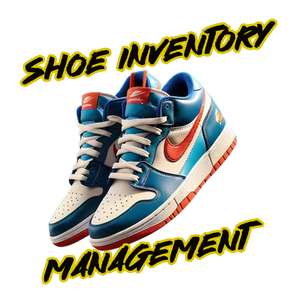
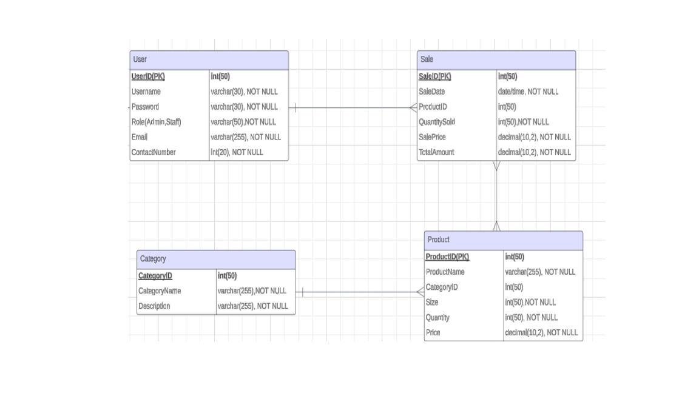
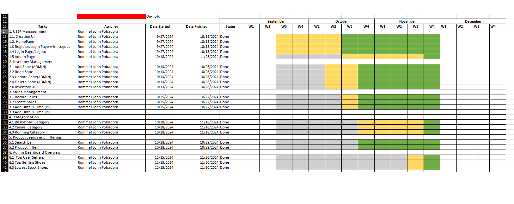
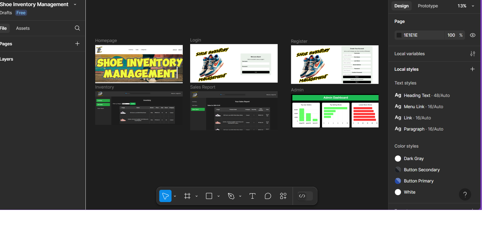

# Shoe Inventory Management System

Shoe Inventory Management System is a web-based program designed to help shoe shops manage their inventory more efficiently. The system tracks stock levels, monitors sales, updates inventory in real-time, and generates insightful reports on sales patterns and inventory status. The goal is to streamline inventory procedures, reduce errors, and improve decision-making about stock replenishment and product availability.

---

### Member
Rommel John L. Pobadora


---
## Features

### 1. **User Management**
   - Role-based access control.
   - Separate logins for administrators and regular users.

### 2. **Inventory Management**
   - **Administrators:** Full control to create, update, and delete shoe records, ensuring effective inventory management.
   - **Regular Users:** Read-only access to view available shoes.

### 3. **Sales Management**
   - **Administrators:** View all sales records, manage them, and access details of all users' sales.
   - **Regular Users:** Limited to viewing their own sales data.

### 4. **Shoe Categorization**
   - Filter shoes based on predefined categories such as:
     - Running
     - Basketball
     - Casual
   - Enhances navigation and browsing for all users.

### 5. **Product Search**
   - Search shoes using criteria like:
     - Name
     - Category
     - Stock availability
     - Price

### 6. **Admin Dashboard**
   - Interactive visual overview with:
     - **Top User Sellers:** Highlights users with the highest sales performance.
     - **Top-Selling Shoes:** Displays the most popular items.
     - **Lowest Stock Levels:** Identifies products with the lowest inventory for proactive restocking.

---

## Technologies Used

- **Backend:** Django
- **Frontend:** HTML, CSS, JavaScript

---
## Installation

## How to Clone and Run the Project

Follow these steps to clone and run the project locally.

### Step 1: Clone the Repository

1. Open your terminal or command prompt.
2. Navigate to the directory where you want to clone the project.
3. Run the following command to clone the repository:

   ```bash
   git clone https://github.com/rommelmars/IM2.git
4.After cloning, navigate into the project directory:
    
    
    cd shoeinventory
### Step 2: Set Up Virtual Environment
It's recommended to set up a virtual environment to isolate the project's dependencies. Run the following command to create the virtual environment:

      
      python -m venv venv

Activate the virtual environment:

      
      venv\Scripts\activate

### Step 3: Install Dependencies
Install the required dependencies for the project by running:

   
      pip install -r requirements.txt

### Step 4: Set Up the Database
Apply the migrations to set up the database by running:

      python manage.py makemigrations
      python manage.py migrate
### Step 5: Create a Superuser 
If you want to access the Django admin panel, create a superuser by running:

      python manage.py createsuperuser
### Step 6: Run the Development Server

      python manage.py runserver
### Step 7: Access the Login Admin Panel 
To access the Django login admin panel, go to:

      http://127.0.0.1:8000/admin_login/









